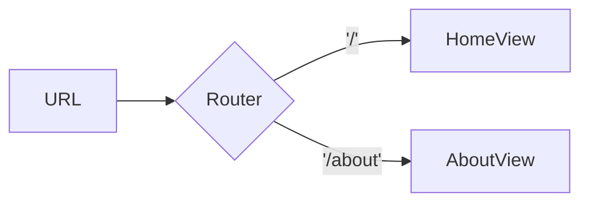

# Visão Geral da Arquitetura

O projeto utiliza **Vue 3** com **TypeScript** e segue a estrutura padrão do Vite.

```
src/
  App.vue           # Componente raiz
  assets/           # Arquivos estáticos e estilos
  components/       # Componentes reutilizáveis
  router/           # Configuração das rotas
  stores/           # Estados globais (Pinia)
  views/            # Páginas principais
  main.ts           # Ponto de entrada da aplicação
```

## Funcionamento das rotas

As rotas são declaradas em `src/router/index.ts`. Cada rota possui um caminho (`path`), um nome e o componente correspondente. Exemplo básico:

```ts
const router = createRouter({
  history: createWebHistory(import.meta.env.BASE_URL),
  routes: [
    { path: "/", name: "home", component: HomeView },
    {
      path: "/about",
      name: "about",
      component: () => import("../views/AboutView.vue"),
    },
  ],
});
```

Diagrama simples das rotas:



## Dicas Importantes

1. **Componentes** ficam em `src/components`. Utilize extensão `.vue`.
2. **Vistas (pages)** ficam em `src/views` e costumam ser usadas diretamente nas rotas.
3. **Stores** via Pinia ficam em `src/stores`. Utilize funções para definir o estado e ações.
4. **Serviços** (requisições a APIs) podem ser organizados em `src/services` (crie a pasta se necessário).
5. Use `npm run dev` para rodar o servidor de desenvolvimento.
